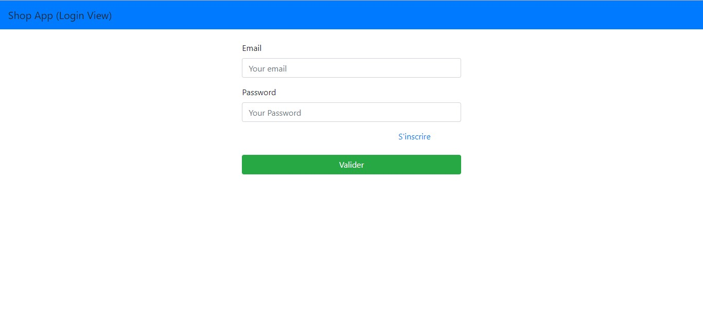

# Nodejs getting Started

Simple project can help you to understand nodeJs    principe and syntax

## About project
    
the application gives the possibility to a user to manage his products

## Dependences
list of packages important for deploiment of the application
* express : engine to generate view
* bcrypt : to encrypt password
* body-parser : to pass parameter in request objet
* cookie-session : to manage session of user
* ejs : engine to generate view
* sequelize : ORM manager for nodeJs
* sequelize-cli : allow command line interfice for sequelize
* mysql2 : to use MYSQL SGBD

## features 
1. User
    - register
    - login
    - logout
    
2. product
    - create
    - delete
    - listing all product

## Usage
    
* clone repository
* move to cloned repository

run the following command
    
```bash
npm install
sequelize db:create
sequelize db:migrate
```

reassure you to have the SGBD mysql deployed on your machine

update the property to database connection (development) on 

```
config\config.json
```

and start server with

```
npm start
```

in your favorite browser launch

```
localhost:9000
```

the following view will be showing

